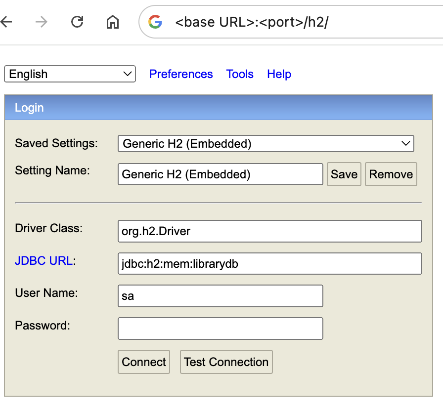

## Library Management API Task Guidance

In ``ABC`` library, a librarian should first access/authenticate the library system, and 
then he could manage authors and books in the library, where a normal user can not access these.
Please consider that a book can be written by multiple authors, and one author could
write multiple books.

The main intention/ scope of this task is to see how you are going to handle this relationship with`author` and `book` 
to create REST API functionality to handle it by using JPA.
This assignment is to create a demo project with APIs for managing `Book` and `Author` information with 
Springboot and JPA.
In-memory H2 database has been used for the simplicity and fast setup.
Please note that no fancy UI front-end is needed, and back-end API functionality is enough.

### Execution Environment:
- Java version: 17
- Maven version: 3.*
- Spring Boot version: 3.2.7
- H2 In-memory DB: 2.*

### Test Files:
- src/test/*

### Request Data:
Please use the utility for generating 100 random json model data (run AuthorJsonGenerator and BookJsonGenerator classes)
to generate random input data), under  `src/test/java/demo/library/jsonGeneratorUtil` path.
You could see the already generated Author and Book json models in the created json files (GeneratedAuthValues.json and
GeneratedBookValues.json).
Please note that in each rerun for Author and Book generator classes, it creates new values.
You could use additional request json objects based on your need for this task:
 
##### Author
```json
{
  "id": 1,
  "name": "Linkon",
  "country": "England",
  "dateBirth": "1998-12-23",
  "bookSet": []
}
```

##### Book
```json
{
   "id": 1,
   "isbn": "isbn67523",
   "title": "Shutter Island",
   "publisher": "TimesView",
   "publishDate": "2023-01-01",
   "authors": []
}
```

### Task Requirement:
Library user must be Authenticated (Basic authentication is sufficient) and REST API functions could be authorized.
The `REST` service must expose two types of endpoints for managing `Author` and `Book` resources, following base URI `http://localhost:<port>/api/v2/<path>` endpoint, which allows for managing the data records in the following way:

#### Author API:

`Create` operation request to create new `author`:
* creates a new Author record (Here you could assume, always Author record must be created prior to Book record creation)
* The returned response should inclue HTTP code 201 by providing the response body as the created record with the unique
  id returned from db
* Any internally occurred error should be also handled

`FETCH` operation request to list all `authors`:
* As a librarian  he should be able to find author by author unique id
* This should return HTTP 200 response code, along with the fetched author results
* the return response should contain the list of author records 
* Any internally occurred error should be also handled

`FETCH` operation request for `author` findById:
* As a librarian he should be able to find author by author unique id 
* returns a record with the given id and status code 200
* if there is no record in the database with the given id, the response code is 404
* Any internally occurred error should be also handled


`DELETE` request to delete `author` by authorId:
* As a librarian he should be able to delete by author unique id
* deletes the record with the given id from the database and return status code 200
* if there was no record in the database with the given id, the response code is 404
* Any internally occurred error should be also handled

#### Book API:

`Create` operation request to create new `book`:
* creates a new Book record (Here you could assume, always Author record must be created prior to Book record creation)
* The returned response should inclue HTTP code 201 by providing the response body as the created record with the unique
  id returned from db
* Any internally occurred error should be also handled

`FETCH` operation request to list all `book`:
* As a librarian  he should be able to find book by book unique id
* This should return HTTP 200 response code, along with the fetched book results
* the return response should contain the list of book records
* Any internally occurred error should be also handled

`FETCH` operation request for `book` findById:
* As a librarian he should be able to find book by book unique id
* returns a record with the given id and status code 200
* if there is no record in the database with the given id it should send the error response with proper status code
* Any internally occurred error should be also handled

`DELETE` request to delete `book` by bookId:
* As a librarian he should be able to delete by book unique id
* deletes the record with the given id from the database and return status code 200
* if there is no record in the database with the given id it should send the error response with proper status code
* Any internally occurred error should be also handled

* `FETCH` operation request for `author` search by title OR author OR ISBN:
* As a librarian he should be able to search functionality by book title, author, or ISBN
* Please note the `title` and `author`name can be match partially

Your task is to complete the given project. More over you could write unit tests. 
The project by default supports the use of the H2 database.
The library does not require no fancy UI. In fact, you could test API functionality by using `Postman` or `CURL` or `unit tests` or any other `http request sender`.
## Commands
- run: 
```bash
 mvn clean package; java -jar target/libraryManager-0.0.1-SNAPSHOT.jar
```
- install: 
```bash
mvn clean install
```
- install without Tests:
```bash
mvn clean install -DskipTests
```
- test: 
```bash
mvn clean test
```

Also you could check for any db query, you could use H2 console by accessing below. 



**Key Responsibilities:**

- Authenticate/authorize Librarian for accessing library system
- Develop and implement the Book and Author APIs using Spring Boot.
- Ensure secure and efficient database connectivity and interactions.
- Create a well-structured backend architecture with proper entity relationships.
- Write clean, efficient, and well-documented code.
- Provide comprehensive documentation for the APIs and project setup.
- Prepare the project for demonstration purposes, including sample data and usage scenarios.


